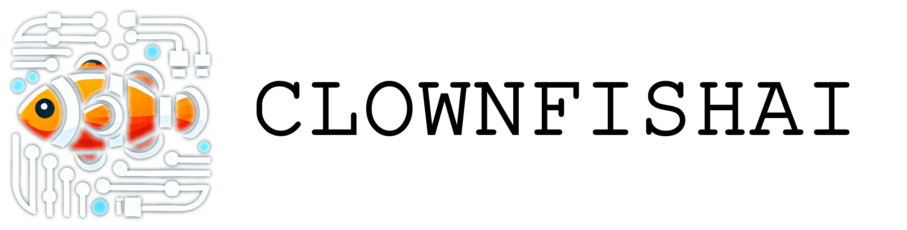
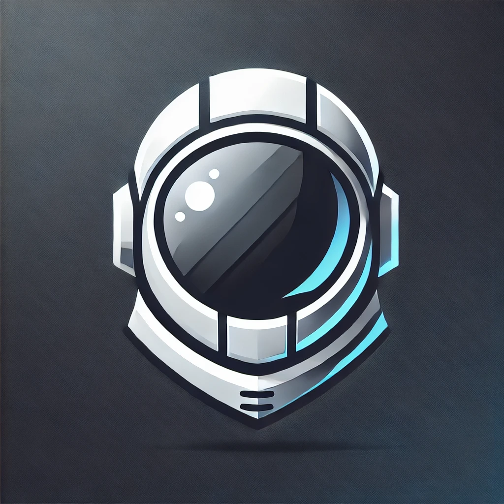
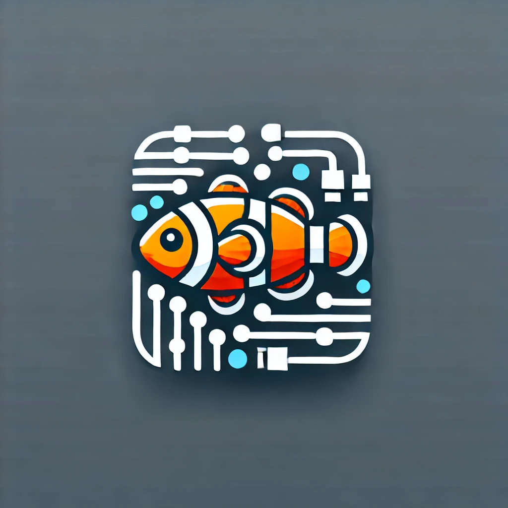
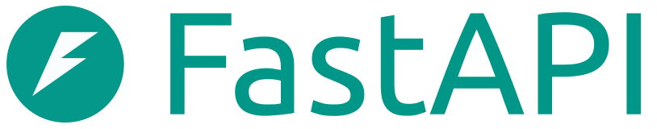

# ClownFishAI

Demonstration of use of AI capacities in the context of CV to sketch Arts.

    
    

## About Project

**Clownfish AI** is a study exploring the development of AI-powered image generation systems. This project delves into the integration of advanced artificial intelligence tools, backend technologies, and modern frontend frameworks to create a seamless image generation experience.

The goal of **Clownfish AI** is to experiment with the end-to-end development of an AI-driven application. By leveraging tools like **Stable Diffusion**, **FastAPI**, **Hugging Face**, and **PyTorch**, this project serves as a hands-on exploration of building and deploying AI systems.

#### By: 
- [George P.](https://github.com/GeorgePaulino)
- [Otaviano M.](https://github.com/Otaviano-Manoel)

## How to Run

### Server

- Install dependencies: `pip install -r requirements.txt`

- Run Server (for default at port 8000): `uvicorn app.main:app --reload`

- To run with API, create a .env file at root of the server project, and define the `HUGGING_TOKEN` equals the token of your Hugging Face account

### Client

- Install dependencies: `npm install`

- Run Client: `npm run dev`

- Access at browser: http://localhost:3000

## Main Dependencies

### Server

- FastAPI

    

- Hugging Face

    

- PyTorch

    

### Client

- NextJS

    

